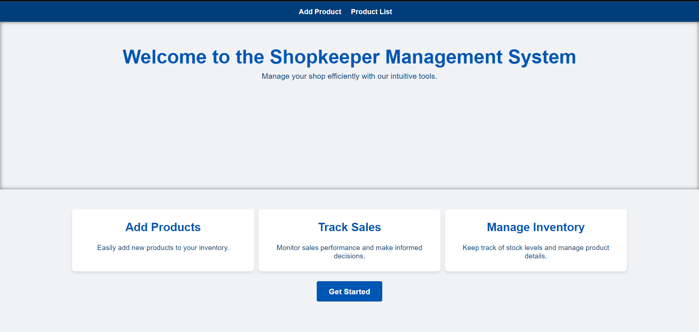
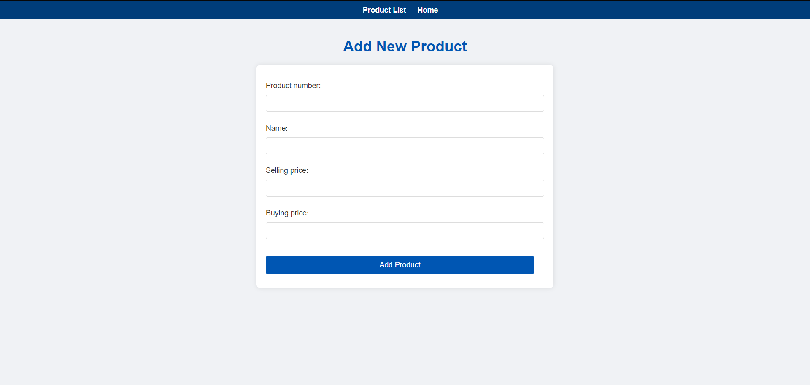
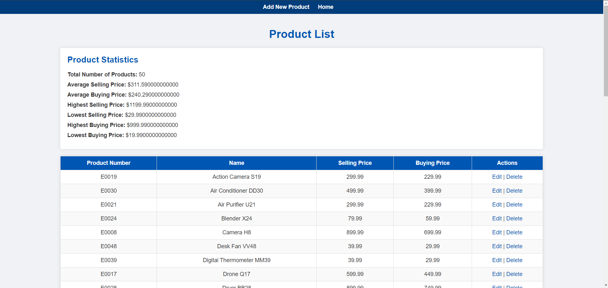
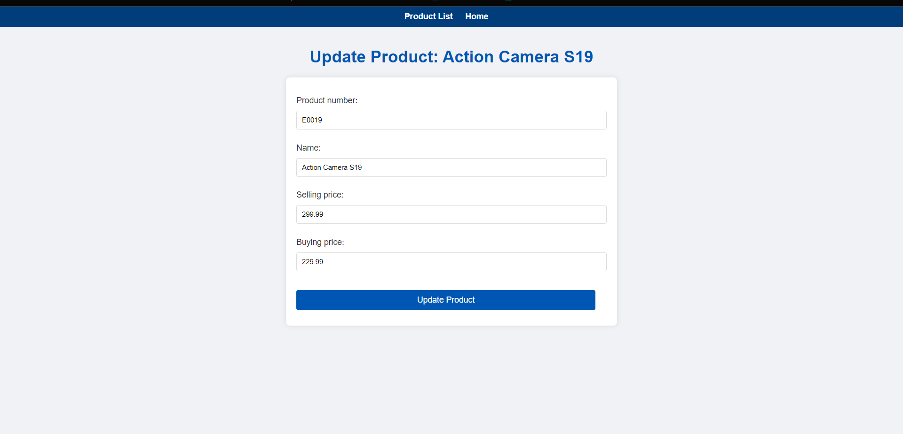
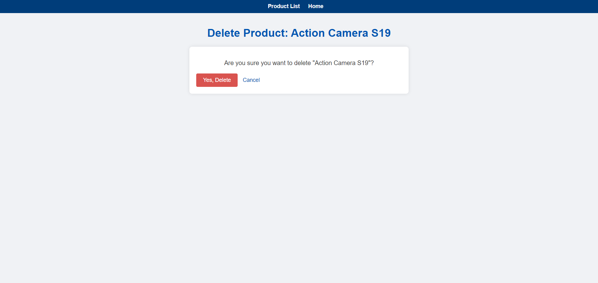

## Shopkeeper Management System

The **Shopkeeper Management System** is a web application designed to help shopkeepers manage their product inventory efficiently. Built using Django, the system allows shopkeepers to add, view, edit, and delete product records. It also supports importing product data from CSV files, making it easy to manage large inventories.





### Features

- **Add New Products**: Shopkeepers can add new products with details such as product number, name, selling price, and buying price.
- **View Product List**: The system provides a detailed list of all products in the inventory.
- **Edit Products**: Shopkeepers can edit product details.
- **Delete Products**: Products can be removed from the inventory.
- **CSV Import**: Bulk import of product data from a CSV file.
- **Admin Interface**: Django's built-in admin interface for managing products.

### Prerequisites

- Python 3.x
- Django 3.x
- A web browser

### Installation

1. **Clone the repository**:
    ```bash
    git clone https://github.com/Nelissa-gitau/Shopkeeper-Management-System
    cd shopkeeper-management-system
    ```

2. **Create a virtual environment**:
    ```bash
    python -m venv env
    source env/bin/activate    # On Windows, use `env\Scripts\activate`
    ```

3. **Install the dependencies**:
    ```bash
    pip install -r requirements.txt
    ```

4. **Apply migrations**:
    ```bash
    python manage.py makemigrations
    python manage.py migrate
    ```

5. **Create a superuser**:
    ```bash
    python manage.py createsuperuser
    ```

6. **Run the development server**:
    ```bash
    python manage.py runserver
    ```

7. **Access the application**:
    Open your web browser and go to `http://127.0.0.1:8000/`.

### Usage

#### Adding a New Product

1. Navigate to the **Add New Product** page from the navigation menu.
2. Fill in the product details:
    - Product Number
    - Name
    - Selling Price
    - Buying Price
3. Click the **Submit** button to add the product.



#### Viewing the Product List

1. Navigate to the **Product List** page from the navigation menu.
2. The product list displays all products in the inventory with details such as product number, name, selling price, and buying price.
3. You can edit or delete a product using the links provided in the Actions column.



#### Editing a Product

1. From the **Product List** page, click the **Edit** link next to the product you want to edit.
2. Update the product details as required.
3. Click the **Submit** button to save the changes.



#### Deleting a Product

1. From the **Product List** page, click the **Delete** link next to the product you want to delete.
2. Confirm the deletion.



#### Importing Products from a CSV File

1. Create a CSV file with the following columns: `product_number`, `name`, `selling_price`, `buying_price`.
2. Save the CSV file in the `data` directory within your project.
3. Run the import command:
    ```bash
    python manage.py import_electronics data/products.csv
    ```


### Contributing

If you would like to contribute to this project, please follow these steps:

1. Fork the repository.
2. Create a new branch (`git checkout -b feature-branch`).
3. Make your changes.
4. Commit your changes (`git commit -m 'Add some feature'`).
5. Push to the branch (`git push origin feature-branch`).
6. Create a new Pull Request.

### License

This project is licensed under the MIT License - see the [LICENSE](LICENSE) file for details.

